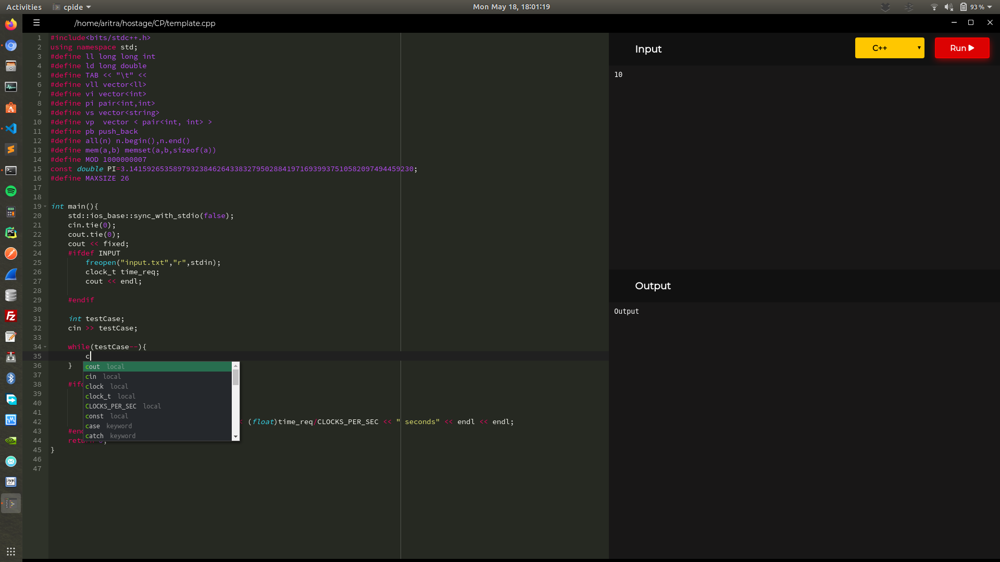

## CPIDE (BETA)
A lightweight cross-platform code editor with advanced features built for competitive programmers.

- [Download For Linux | Deb](https://media.githubusercontent.com/media/aritra1999/CP-IDE/master/out/make/deb/x64/cpide_1.0.0_amd64.deb) | x64 
- [Download For Linux | Rpm](https://media.githubusercontent.com/media/aritra1999/CP-IDE/master/out/make/deb/x64/cpide_1.0.0_amd64.rpm) | x64 
- <a href="https://media.githubusercontent.com/media/aritra1999/CP-IDE/master/out/make/squirrel.windows/x64/cpide-1.0.0 Setup.exe">Download For Windows</a> | x64
- [Download For MacOS](#) | x64

### Supported Languages
- C++
- C
- Python 
- Java
  
### Features
- Live autocomplete 
- 39 Themes
<<<<<<< HEAD
- Find and replace.
=======
- Efficient workflow
>>>>>>> 0f239c6a81f05bf1e07b4499b6738af818bfb80c

### Future features
- Add your own code templates.
- Question preview from the code editor.
<<<<<<< HEAD

### Default Shortcuts

| Command  | Shrotcut (Ctrl + ) |
|---|---|
| Save | s |
| Run  | Enter |
| Open  | o |
| Close | x |
| Find | f |
| Replace | h | 
=======
- Selecting your own input files. 
- Shortcuts for an efficient workflow. 
- Improved design.
>>>>>>> 0f239c6a81f05bf1e07b4499b6738af818bfb80c

### License

MIT License | Copyright (c) Aritra Mondal  
[Full license](LICENSE.md)
